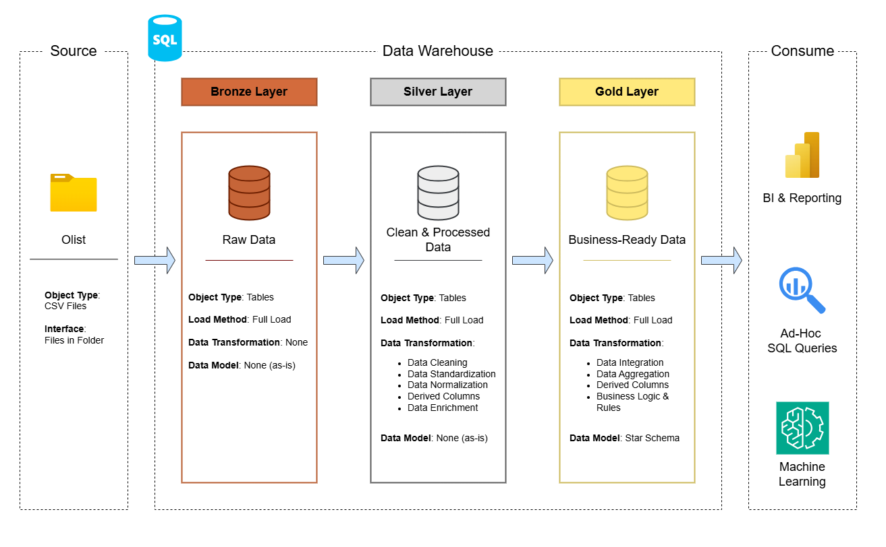

# Data Warehouse and Analytics Project

Welcome to the **Data Warehouse and Analytics Project** repository by Massimo Chialastri!   
This project demonstrates a comprehensive data warehousing and analytics solution, from building a data warehouse to generating actionable insights. Designed as a portfolio project, it highlights industry best practices in data engineering and analytics.

---

## 🏗️ Data Architecture

The data architecture for this project follows the **Medallion Architecture** with **Bronze**, **Silver**, and **Gold** layers:



1. **Bronze Layer**: Stores raw data as-is from the source systems. Data is ingested from CSV files into the SQL Server database with no transformations applied.
2. **Silver Layer**: Includes data cleansing, standardization, and normalization processes to prepare data for analysis.
3. **Gold Layer**: Houses business-ready data modeled into a galaxy star schema optimized for reporting and analytics.

---

## 📖 Project Overview

This project involves:

1. **Data Architecture**: Designing a Modern Data Warehouse using Medallion Architecture (**Bronze**, **Silver**, and **Gold** layers).
2. **ETL Pipelines**: Extracting, transforming, and loading data from source systems into the warehouse.
3. **Data Modeling**: Developing fact and dimension tables optimized for analytical queries (galaxy star schema).
4. **Analytics & Reporting**: Creating SQL-based reports and dashboards for actionable insights.
5. **Power BI Report**: Building an end-to-end interactive Power BI report connected to the Gold layer, delivering visual insights on customer behavior, product performance, and sales trends.

🎯 This repository is an excellent resource for professionals and students looking to showcase expertise in:
- SQL Development (T-SQL)
- Data Architecture
- Data Engineering
- ETL Pipeline Development
- Data Modeling
- Data Analytics
- Power BI Reporting

---

## 🛠️ Tools & Resources

- **[SQL Server Express](https://www.microsoft.com/en-us/sql-server/sql-server-downloads):** Lightweight server for hosting your SQL database.
- **[SQL Server Management Studio (SSMS)](https://learn.microsoft.com/en-us/sql/ssms/download-sql-server-management-studio-ssms?view=sql-server-ver16):** GUI for managing and interacting with databases.
- **[Power BI Desktop](https://powerbi.microsoft.com/en-us/desktop/):** Business intelligence tool used to build the final interactive report connected to the Gold layer.
- **[Git Repository](https://github.com/):** Set up a GitHub account to manage, version, and collaborate on your code.
- **[DrawIO](https://www.drawio.com/):** Design data architecture, models, flows, and diagrams.

---

## 📦 Dataset

This project uses the **Brazilian E-Commerce Public Dataset by Olist**, publicly available on Kaggle.

> 📥 **Download the dataset:** [https://www.kaggle.com/datasets/olistbr/brazilian-ecommerce](https://www.kaggle.com/datasets/olistbr/brazilian-ecommerce)

The dataset contains real anonymized commercial data from orders placed on the Olist e-commerce platform in Brazil between 2016 and 2018. It covers the full order lifecycle — from purchase to delivery and customer review — across multiple interconnected tables:

| File | Description |
|---|---|
| `customers.csv` | Customer information including location (city, state) and unique identifiers |
| `geolocation.csv` | Geolocation data mapping Brazilian zip codes to latitude/longitude coordinates |
| `orders.csv` | Order-level data including status, purchase timestamp, and delivery dates |
| `order_items.csv` | Details of each item within an order (product, seller, price, freight) |
| `order_payments.csv` | Payment information per order (type, installments, value) |
| `order_reviews.csv` | Customer reviews including scores and comments submitted after delivery |
| `products.csv` | Product attributes such as category, dimensions, and weight |
| `product_category_name_translation.csv` | Translation of product category names from Portuguese to English |
| `sellers.csv` | Seller information including location (city, state) |

---


### Building the Data Warehouse (Data Engineering)

#### Objective
Develop a modern data warehouse using SQL Server to consolidate sales data, enabling analytical reporting and informed decision-making.

#### Specifications
- **Data Sources**: Import data from the Brazilian e-commerce platform **Olist**, provided as CSV files (customers, orders, order items, payments, reviews, products, sellers, geolocation).
- **Data Quality**: Cleanse and resolve data quality issues prior to analysis.
- **Integration**: Combine both sources into a single, user-friendly data model designed for analytical queries.
- **Scope**: Focus on the latest dataset only; historization of data is not required.
- **Documentation**: Provide clear documentation of the data model to support both business stakeholders and analytics teams.

---

### BI: Analytics & Reporting (Data Analysis)

#### Objective
Develop SQL-based analytics to deliver detailed insights into:
- **Customer Behavior**
- **Product Performance**
- **Sales Trends**

These insights empower stakeholders with key business metrics, enabling strategic decision-making.

For more details, refer to [docs/requirements.md](docs/requirements.md).

---

## 📂 Repository Structure

```
SQL-Data-Warehouse-Project/
│
├── datasets/                               # Raw datasets used for the project
│   ├── customers.csv
│   ├── geolocation.csv
│   ├── order_items.csv
│   ├── order_payments.csv
│   ├── order_reviews.csv
│   ├── orders.csv
│   ├── product_category_name_translation.csv
│   ├── products.csv
│   └── sellers.csv
│
├── docs/                                   # Project documentation and architecture details
│   ├── data_architecture.png               # Data architecture diagram
│   ├── data_catalog.md                     # Catalog of datasets with field descriptions and metadata
│   ├── data_flows.png                      # Data flow diagram
│   ├── data_layers.png                     # Medallion layers diagram
│   ├── data_model.png                      # Star schema data model diagram
│   ├── integration_model.png               # Source integration model diagram
│   └── requirements.md                     # Requirements file
│
├── report/                                 # Power BI report and supporting visuals
│   ├── .gitattributes
│   ├── customers.png
│   ├── items.png
│   ├── olist_report.pbix                   # Power BI report file (.pbix)
│   ├── overview.png
│   ├── reviews.png
│   └── sellers.png
│
├── scripts/                                # SQL scripts for ETL and transformations
│   ├── init_database.sql                   # Database initialization script
│   ├── bronze/
│   │   ├── ddl_bronze.sql                  # DDL for Bronze layer tables
│   │   └── load_bronze.sql                 # Stored procedure to load raw data
│   ├── gold/
│   │   ├── ddl_gold.sql                    # DDL for Gold layer views/tables
│   │   └── load_gold.sql                   # Script to populate the Gold layer
│   └── silver/
│       ├── clean_names_fix.sql             # Data cleansing and name normalization
│       ├── ddl_silver.sql                  # DDL for Silver layer tables
│       └── load_silver.sql                 # Stored procedure to load Silver layer
│
├── tests/                                  # Test scripts and data quality checks
│   ├── quality_checks_gold.sql             # Quality checks for the Gold layer
│   └── quality_checks_silver.sql           # Quality checks for the Silver layer
│
├── .gitattributes
├── LICENSE                                 # MIT License
└── README.md                               # Project overview and instructions
```

---

## ⚙️ Getting Started

### Prerequisites

1. Install [SQL Server Express](https://www.microsoft.com/en-us/sql-server/sql-server-downloads)
2. Install [SQL Server Management Studio (SSMS)](https://learn.microsoft.com/en-us/sql/ssms/download-sql-server-management-studio-ssms?view=sql-server-ver16)
3. Clone the repository:
   ```bash
   git clone https://github.com/MassimoChialastri/SQL-Data-Warehouse-Project.git
   ```

### Running the Project

1. **Bronze Layer** – Execute the scripts in `scripts/bronze/` to create and load the raw tables from the CSV source files.
2. **Silver Layer** – Execute the scripts in `scripts/silver/` to cleanse, standardize, and normalize the data.
3. **Gold Layer** – Execute the scripts in `scripts/gold/` to build the analytical model views and tables (star schema).
4. **Reports** – Open the Power BI file in the `report/` folder to explore the interactive dashboard covering customers, products, and sales trends.

---

## 🛡️ License

This project is licensed under the [MIT License](LICENSE). You are free to use, modify, and share this project with proper attribution.

---

## 🌟 About

**Massimo Chialastri**

[](https://github.com/MassimoChialastri)

---

> Project developed following the **SQL Data Warehouse Project** course by [Data With Baraa](https://www.datawithbaraa.com).
